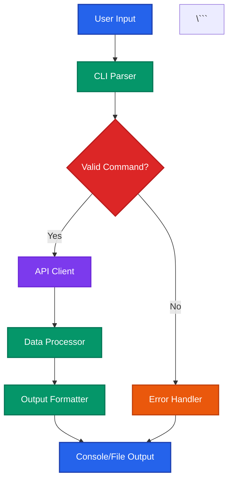
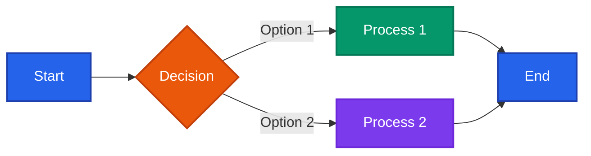

# Agent Guidelines for Writing Documentation

This document provides guidelines for AI agents contributing to the
mtgjson-cli documentation. Following these guidelines ensures consistency,
clarity, and accessibility across all documentation.

## Table of Contents

* [Markdown Validation](#markdown-validation)
* [Markdown Style Guidelines](#markdown-style-guidelines)
* [Mermaid Diagram Guidelines](#mermaid-diagram-guidelines)
* [WCAG AAA Color Compliance](#wcag-aaa-color-compliance)
* [Best Practices](#best-practices)

## Markdown Validation

**IMPORTANT**: This project uses the `markdownlint-mcp` tool for automated
markdown validation. Instead of memorizing specific formatting rules, you
should use this tool to validate and fix your markdown documents.

### Using markdownlint-mcp

1. **Before Committing**: Always validate your markdown files using the
   markdownlint-mcp tool before finalizing your changes.

2. **How to Use**: The markdownlint-mcp tool is available as an MCP server
   integration. Use it to:
   * Check markdown files for linting violations
   * Get specific error descriptions with line numbers
   * Understand which rules are being violated
   * Apply automatic fixes where possible

3. **Workflow**:
   * Write your markdown content following the general principles below
   * Run markdownlint-mcp to validate the document
   * Review and fix any reported issues
   * Re-run validation to confirm all issues are resolved

4. **Benefits**: Using the tool ensures:
   * Consistent formatting across all documentation
   * Compliance with project standards
   * Catching issues early before code review
   * Learning markdown best practices through feedback

**Note**: The sections below provide high-level guidance. For specific
formatting requirements, always defer to markdownlint-mcp validation results.

## Markdown Style Guidelines

These guidelines provide high-level principles for writing markdown
documentation. For specific formatting requirements, use the markdownlint-mcp
tool to validate your work.

### General Principles

1. **Clarity First**: Write for clarity and understanding. Assume readers
   may be new to the project.
2. **Consistency**: Follow the patterns established in existing
   documentation and validated by markdownlint-mcp.
3. **Conciseness**: Be clear and complete, but avoid unnecessary
   verbosity.
4. **Active Voice**: Use active voice whenever possible for better
   readability.

### Content Guidelines

1. **Document Structure**: Use a clear heading hierarchy with a single H1
   title and logical section organization.

2. **Code Examples**: Always specify the language for code blocks to enable
   syntax highlighting. Use inline code formatting for commands, file names,
   and technical terms.

3. **Lists**: Use ordered lists for sequential steps, unordered lists for
   non-sequential items. Keep list items parallel in structure.

4. **Links**: Use descriptive link text (avoid "click here"). Prefer
   relative paths for internal documentation links.

5. **Tables**: Include clear headers and maintain readability. Align
   content appropriately.

**Remember**: Run markdownlint-mcp after writing to ensure your markdown
follows all formatting rules. The tool will catch spacing issues, list
formatting, line length problems, and other common mistakes.

## Mermaid Diagram Guidelines

### When to Use Diagrams

Include Mermaid diagrams when they help clarify:

1. **System Architecture**: Component relationships and data flow
2. **Process Flows**: Step-by-step workflows or decision trees
3. **State Transitions**: State machines or lifecycle diagrams
4. **Data Relationships**: Entity relationships or data structures
5. **Sequence Diagrams**: Interaction between components over time

### Diagram Types

Choose the appropriate diagram type for your content:

* **Flowchart**: Process flows, decision trees, algorithms
* **Sequence Diagram**: Component interactions, API calls, message flows
* **Class Diagram**: Object structures, type hierarchies
* **State Diagram**: State machines, status transitions
* **Gantt Chart**: Project timelines, schedules
* **Git Graph**: Branch strategies, version control workflows

### Diagram Best Practices

1. **Keep It Simple**: Focus on the essential elements. Break complex
   diagrams into multiple simpler ones.
2. **Use Descriptive Labels**: All nodes, edges, and elements should have
   clear, descriptive labels.
3. **Consistent Naming**: Use the same terminology as the codebase and
   other documentation.
4. **Add Context**: Include a brief description before the diagram
   explaining what it shows.
5. **Direction**: Choose the most intuitive direction (top-to-bottom,
   left-to-right) for your content.

### Example Diagram Structure

The following shows how to structure a diagram with proper context:

```markdown
#### Data Flow Architecture

The following diagram shows how data flows through the MTGJSON CLI
application:



## WCAG AAA Color Compliance

All Mermaid diagrams MUST use colors that meet WCAG AAA accessibility
standards for color contrast. This ensures diagrams are readable by everyone,
including users with visual impairments.

### Color Requirements

1. **Contrast Ratio**: Minimum 7:1 for normal text, 4.5:1 for large text
   (WCAG AAA standard)
2. **Text on Background**: Always ensure sufficient contrast between text
   and background colors
3. **Don't Rely on Color Alone**: Use text labels, patterns, or shapes in
   addition to color to convey information

### Approved Color Palette

Use these pre-approved color combinations that meet WCAG AAA standards:

#### Primary Colors (for main elements)

```markdown
Blue: fill:#2563eb,stroke:#1e40af,stroke-width:2px,color:#ffffff
* Background: #2563eb (Blue 600)
* Border: #1e40af (Blue 700)
* Text: #ffffff (White) - Contrast ratio: 8.6:1 ✓

Green: fill:#059669,stroke:#047857,stroke-width:2px,color:#ffffff
* Background: #059669 (Emerald 600)
* Border: #047857 (Emerald 700)
* Text: #ffffff (White) - Contrast ratio: 7.8:1 ✓

Purple: fill:#7c3aed,stroke:#6d28d9,stroke-width:2px,color:#ffffff
* Background: #7c3aed (Violet 600)
* Border: #6d28d9 (Violet 700)
* Text: #ffffff (White) - Contrast ratio: 8.3:1 ✓

Red: fill:#dc2626,stroke:#b91c1c,stroke-width:2px,color:#ffffff
* Background: #dc2626 (Red 600)
* Border: #b91c1c (Red 700)
* Text: #ffffff (White) - Contrast ratio: 9.2:1 ✓

Orange: fill:#ea580c,stroke:#c2410c,stroke-width:2px,color:#ffffff
* Background: #ea580c (Orange 600)
* Border: #c2410c (Orange 700)
* Text: #ffffff (White) - Contrast ratio: 8.1:1 ✓
```

#### Semantic Colors

```markdown
Success: fill:#059669,stroke:#047857,stroke-width:2px,color:#ffffff
(Green - use for success states, positive outcomes)

Warning: fill:#ea580c,stroke:#c2410c,stroke-width:2px,color:#ffffff
(Orange - use for warnings, caution states)

Error: fill:#dc2626,stroke:#b91c1c,stroke-width:2px,color:#ffffff
(Red - use for errors, failures, critical states)

Info: fill:#2563eb,stroke:#1e40af,stroke-width:2px,color:#ffffff
(Blue - use for informational states)

Process: fill:#7c3aed,stroke:#6d28d9,stroke-width:2px,color:#ffffff
(Purple - use for processing, transformation states)
```

#### Light Mode Alternative

For diagrams that need lighter backgrounds:

```markdown
Light Blue: fill:#dbeafe,stroke:#1e40af,stroke-width:2px,color:#1e3a8a
* Background: #dbeafe (Blue 100)
* Border: #1e40af (Blue 700)
* Text: #1e3a8a (Blue 900) - Contrast ratio: 11.4:1 ✓

Light Green: fill:#d1fae5,stroke:#047857,stroke-width:2px,color:#064e3b
* Background: #d1fae5 (Emerald 100)
* Border: #047857 (Emerald 700)
* Text: #064e3b (Emerald 900) - Contrast ratio: 10.8:1 ✓
```

### Testing Color Contrast

Before using any custom colors, verify contrast ratios using:

* [WebAIM Contrast Checker](https://webaim.org/resources/contrastchecker/)
* [Contrast Ratio Calculator](https://contrast-ratio.com/)

Ensure all text-to-background combinations achieve at least 7:1 contrast ratio.

### Color Usage Example



## Best Practices

### Documentation Quality Checklist

Before completing your documentation work, verify:

* [ ] Document has been validated with markdownlint-mcp (zero errors)
* [ ] All markdownlint-mcp issues have been resolved
* [ ] Code examples include syntax highlighting
* [ ] Links are valid and use descriptive text
* [ ] Diagrams use WCAG AAA compliant colors
* [ ] Diagrams have descriptive context/captions
* [ ] No spelling or grammar errors
* [ ] Terminology is consistent with existing docs
* [ ] Document is readable by someone unfamiliar with the code

### Common Pitfalls to Avoid

1. **Outdated Information**: Keep documentation in sync with code changes
2. **Missing Context**: Don't assume readers know everything about the
   project
3. **Poor Accessibility**: Always test color contrast and provide text
   alternatives
4. **Over-Engineering**: Simple is better than complex for documentation
5. **Orphaned Docs**: Ensure all documentation is linked from relevant
   locations

### Maintenance

1. **Review Regularly**: Documentation should be reviewed when code changes
2. **User Feedback**: Consider user questions as signals for documentation
   gaps
3. **Version Notes**: If behavior changes between versions, note it clearly
4. **Deprecation**: Mark deprecated features clearly and provide migration
   paths

### Getting Help

If you're unsure about any aspect of documentation:

1. Use markdownlint-mcp to validate your markdown and identify issues
2. Review existing documentation for patterns and examples
3. Check this guide for high-level principles
4. Ask for clarification in comments before proceeding
5. When in doubt, prioritize clarity and accessibility

---

**Version**: 1.0  
**Last Updated**: 2026-02-07  
**Maintained by**: mtgjson-cli contributors
